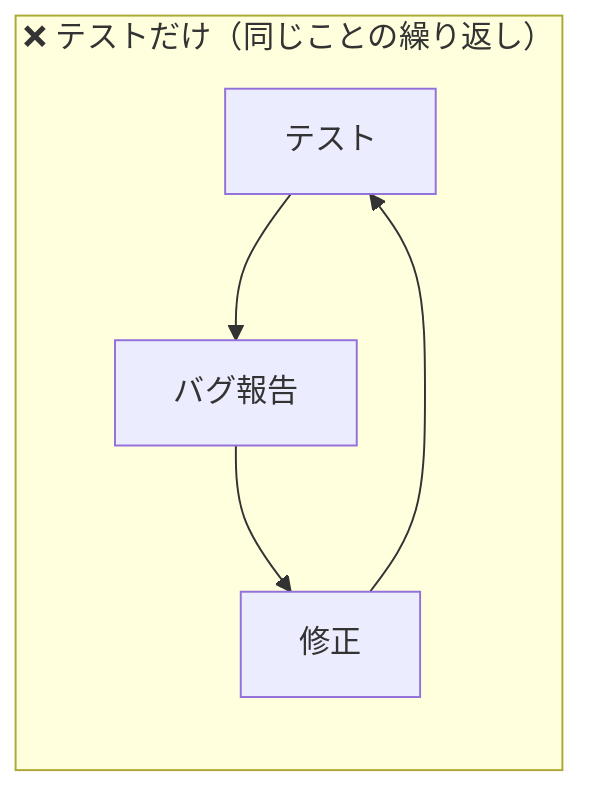
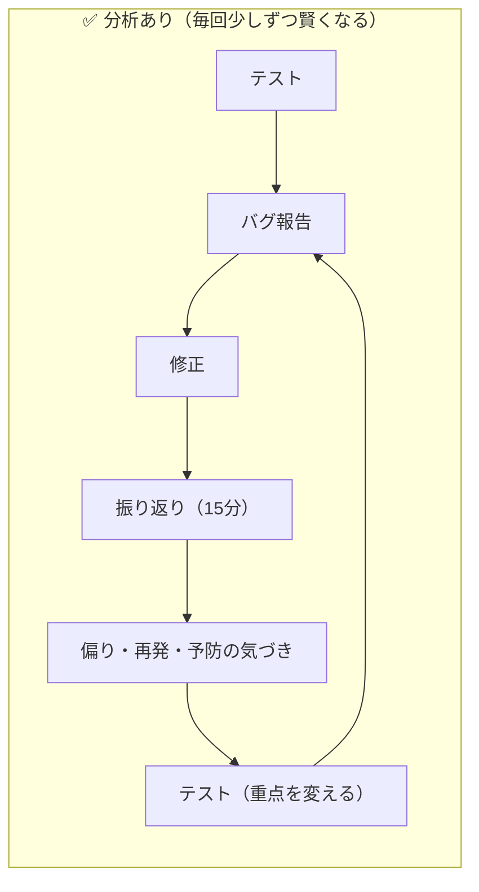

## 「テスト＝QA」を卒業したい。でも何から？

[以前の記事](https://zenn.dev/bitkey_dev/articles/test-equals-qa)で、テストとQAは違うという話を書きました。

テストは「測る」行為です。QAは「良いものが生まれる仕組みをつくる」行為です。勉強にたとえるなら、テストは問題を解くことであり、QAは勉強法そのものを改善することです。

反応をもらった中で一番多かったのが、**「わかった。で、具体的に何をすればいい？」** でした。正直、自分も最初はそうでした。

品質戦略の担当になったとき、「分析しよう」と意気込んでパレート分析やODCの教科書を開きました。でもデータが整っていません。ツールもありません。チームに「分析会議やりましょう」と言っても「その時間あるならテスト回したい」と返されます。結局、最初の3カ月は何も始められませんでした。

転機は、**毎週15分だけ、バグを3つの問いで振り返る**ことを一人で始めたときでした。

:::details パレート分析・なぜなぜ分析・ODCとは？
品質分析でよく出てくる3つの手法です。勉強にたとえると:

- **パレート分析** = 点が取れなかった科目を特定して、そこから重点的に復習する。「全体の80%の問題は20%の原因から生まれる」という法則に基づき、影響の大きい原因から潰す手法
- **なぜなぜ分析** = 「なぜ間違えた？」→「なぜその勉強法だった？」→「なぜ時間がなかった？」と5回掘り下げて根本原因を見つける手法
- **ODC（Orthogonal Defect Classification）** = 間違いを「ケアレスミス」「理解不足」「問題の読み間違い」のように種類別に分類する手法。IBMが考案したバグの分類体系

この記事で紹介する「3つの問い」は、これらの手法を使わなくても始められる、最小の分析習慣です。
:::

この記事は、そういう現場が**来週から始められる、最小の分析習慣**の話です。

## 分析は「問い」であって「手法」ではない

分析と聞くと、統計やグラフを思い浮かべるかもしれません。でも分析の本質は手法ではありません。

**「なぜ？」と問うこと**です。ただそれだけです。

勉強のたとえに戻ります。

```
テスト   → 問題を解く    → 何点だったかわかる
分析     → 答え合わせ    → なぜ間違えたかわかる
```

答え合わせに高度な手法は要りません。やることは3つだけです。

1. 間違えた問題をみる
2. なぜ間違えたか考える
3. 次にどうするか決める

バグに置きかえると:

1. **今週のバグをみる**
2. **なぜこのバグが生まれたか考える**
3. **次のスプリントで何を変えるか決める**

:::details スプリントとは？
アジャイル開発における1〜2週間の開発サイクルのこと。学校の時間割が1週間単位で回るように、開発チームも「今週やること」を決めて、1〜2週間で区切りながら開発を進めます。スプリントごとにテスト→振り返りを回すのが理想です。
:::

これが分析です。フレームワークもダッシュボードも要りません。

## 週15分の振り返り


毎週15分、テスト完了後にチームで（一人でも構いません）バグを振り返ります。それだけで「テストだけのQA」から一歩踏み出せます。

### やること

今週見つけたバグを並べて、3つの問いを投げるだけです。

| 問い | 見ていること | 所要時間 |
|---|---|---|
| ❶ **どこに多い？** | 偏り（特定の機能・画面に集中していないか） | 5分 |
| ❷ **前にも見た？** | 再発（同じパターンのバグが繰り返されていないか） | 5分 |
| ❸ **防げた？** | 予防（設計やレビューの段階で防げたバグはないか） | 5分 |

### ❶ どこに多い？（偏りをみる）

今週のバグを、機能や画面でグルーピングしてみてください。スプレッドシートで十分です。

「決済まわりに3件、設定画面に1件、通知に1件」

これだけで「決済まわりにバグが集中している」という**偏り**が見えます。偏りが見えれば「来週は決済まわりのテストを厚くしよう」という判断ができます。

均等にテストするよりも、偏りに基づいてテストする方が、同じ工数でも多くのバグを見つけられます。

### ❷ 前にも見た？（再発をみる）

「またこの手のバグか」と感じたことはありませんか？

その直感は正しいです。同じパターンのバグが繰り返されているなら、それはテストの問題ではなく**プロセスの問題**です。

- 同じAPIで毎回エラーハンドリングが漏れている → レビューチェックリストに追加
- 同じ画面でレイアウト崩れが繰り返される → デザインシステムの問題かも
- リリースのたびに同じ手順でミスが起きる → デプロイプロセスの見直し

再発パターンを1つ見つけて、1つ対策を打ちます。これがQC（品質管理）の第一歩です。

:::details QA・QC・テストの違い
勉強にたとえると:

| | 勉強でいうと | ソフトウェアでいうと |
|---|---|---|
| **テスト** | 問題を解く | バグを見つける |
| **QC（品質管理）** | 答え合わせをして弱点を潰す | バグの傾向を分析して再発を防ぐ |
| **QA（品質保証）** | 勉強法そのものを改善する | 開発プロセス全体を改善する |

テストだけでは品質は上がりません。この記事の「週15分の振り返り」は、テストからQCへの第一歩です。詳しくは「[テスト＝QAを卒業する日](https://zenn.dev/bitkey_dev/articles/test-equals-qa)」をどうぞ。
:::

### ❸ 防げた？（予防をみる）

見つけたバグの中に、「テストで見つける前に防げたのでは？」というものがないか探します。

- 要件の曖昧さが原因 → 要件レビューに参加すべきだった
- 仕様変更が共有されていなかった → コミュニケーションの問題
- 既知のリスクだったが対策されていなかった → リスク管理の問題

「防げたバグ」が1つでも見つかれば、それは**テストより上流で品質に関わる理由**になります。これがQA（品質保証）への入り口です。

## なぜ15分なのか

長い会議は続きません。

自分のチームでも最初は「月1回の品質分析会議」を設定しました。2時間の枠を取って、バグデータを集めて、スライドを作って……2回目で誰も資料を準備しなくなり、3回目で自然消滅しました。振り返る頃にはバグの記憶が薄れていて、「たしかこういう感じだった気がする」という曖昧な議論にしかなりませんでした。

週15分に変えたら、続きました。品質分析会議を月1回2時間やるより、週15分を4回やる方がはるかに効果があります。

```
月1回 × 2時間 = 記憶が薄れた頃にまとめて振り返る → 形骸化
週1回 × 15分  = 記憶が新鮮なうちにサッと振り返る → 習慣化
```

勉強と同じです。試験前に一夜漬けするより、毎日15分復習する方が成績は上がります。

## 継続するための3つのコツ

### ①記録を1行だけ残す

振り返りの結果を、どこかに1行だけ書いてください。Slackでも、スプレッドシートでも、付箋でも構いません。

```
7/27: 決済に3件集中。カード種別の網羅が不足していた。来週追加する。
```

1行で十分です。この1行が、3カ月後に「あのとき何が起きていたか」を教えてくれます。

### ②完璧を目指さない

15分で深い分析はできません。それで十分です。

「なぜ？」の答えが出なくても大丈夫です。「防げたか？」の判断がつかなくても大丈夫です。問いを立てた時点で、テストだけの状態からは前進しています。

### ③最初は一人で始める

チーム全体を巻き込もうとすると、調整コストで始められなくなります。

まず自分一人で、今週のバグを15分振り返ります。2〜3週間続けてパターンが見えてきたら、「こういうの見えてきたんですけど」と共有します。

自分の場合、3週間分の記録を見せたとき、開発リーダーが「これ、決済まわりだけ毎週出てるじゃん」と気づいてくれました。そこから設計レビューに呼ばれるようになりました。実績を見せた方が、チームは動きます。

## 数字で判断する：指標と閾値

振り返りが習慣になったら、次は「感覚」を「数字」に置き換えます。

### 不具合/実行テストケース比

もっともシンプルな品質指標です。

```
不具合検出率 = 今回見つけた不具合数 ÷ 今回実行したテストケース数
```

例: 200ケース実行して8件のバグ → 4%

この指標なら、テスト管理ツールの数字だけで出せます。特別なデータ収集は不要です。

ただし注意点があります。テストケースの粒度がチームやプロジェクトで異なる場合、単純比較はできません。1ケース3ステップのチームと30ステップのチームでは、同じ5%でも意味が違います。**自チームの推移を追う**用途でつかうのが正しい使い方です。

### 閾値を決める

指標があっても、基準がなければ「高いのか低いのか」が判断できません。

| 指標 | 閾値の例 | 超えたら |
|---|---|---|
| 不具合検出率 | ≥ 5% | テストの前に何か問題がある |
| 前週比 | +50%以上 | 急な悪化。原因調査が必要 |
| Critical件数 | 週3件以上 | すぐトリアージ |
| 1領域への集中度 | 全体の40%以上 | 設計・実装に構造的な問題 |

:::details Severity・Critical・トリアージとは？
- **Severity（深刻度）** = バグの影響の大きさを表すランク。一般的にCritical → Major → Minor → Trivialの4段階で分類する
- **Critical** = サービスが止まる、データが消えるなど、もっとも深刻なレベル。「テスト中に決済が二重課金される」のようなバグ
- **トリアージ** = 「どのバグを先に直すか」を決める優先順位付けのこと。元は医療用語で、災害時に治療の優先順位を決める行為に由来する。週にCriticalが3件出たら、通常の開発を止めてでも対応を判断する場が必要
:::

閾値は最初から完璧に設定する必要はありません。3〜4週間の実績を見て「普段はこのくらい」がわかれば、その1.5倍〜2倍を閾値にすれば十分です。

### 他にも使える指標

| 指標 | 計算式 | 何がわかるか |
|---|---|---|
| 不具合密度(KLOC) | 不具合 ÷ コード千行 | コードの品質 |
| 不具合検出率(DDP) | テスト検出 ÷ 全不具合 | テストの有効性 |
| 不具合除去効率(DRE) | 出荷前除去 ÷ 全体 | プロセスの成熟度 |
| テスト効率 | 不具合 ÷ テスト工数(h) | 投資対効果 |

:::details KLOC・DDP・DREって何？
- **KLOC（Kilo Lines of Code）** = コード1,000行単位のこと。「不具合密度 5件/KLOC」は「コード1,000行あたりバグ5件」の意味。コードの品質を測る基本指標
- **DDP（Defect Detection Percentage）** = テストで見つけたバグ数 ÷ 全バグ数。テストがどれだけバグを捕前られたかの割合。高いほどテストが有効
- **DRE（Defect Removal Efficiency）** = 出荷前に取り除いたバグ数 ÷ 全バグ数（出荷後に見つかったものも含む）。開発プロセス全体の成熟度を測る指標

今すぐ覚える必要はありません。まずは「不具合/テストケース比」だけで十分。振り返りが定着して「もっと精度を上げたい」と感じたら、ここに戻ってきてください。
:::

不具合/テストケース比は「今あるデータで今日から測れる」という点で最初の一歩に最適です。精度を上げたくなったら、上の表の指標に進化させていけます。

## テストだけのループ vs 分析ありのループ





違いは「振り返り」の有無だけです。やることは変わりません。テストの後に15分立ち止まるかどうかです。

## よくある不安

### 「データが整っていないんですが」

完璧なデータは要りません。今週のバグが5件あれば、それを並べて3つの問いを投げるだけ。Severityが設定されていなくても、カテゴリが統一されていなくても、「どこに多い？」は目で見ればわかります。

:::details Severityの設定例
もしこれからSeverityを設定するなら、4段階が基本です:

| レベル | 意味 | 例 |
|---|---|---|
| **Critical** | サービス停止・データ損失 | ログインできない、決済が二重処理される |
| **Major** | 主要機能が使えない | 検索結果が表示されない、通知が届かない |
| **Minor** | 機能は使えるが不便（回避策あり） | 表示が崩れるが操作は可能、エラーメッセージが不親切 |
| **Trivial** | 見た目だけの問題 | 文言の誤字、アイコンのズレ |

最初は感覚で分けて大丈夫。続けるうちにチーム内で基準が揃っていきます。
:::

データを整えるのは、振り返りを続けて「このデータが欲しい」と感じてからで十分です。

### 「分析する時間がありません」

15分です。テスト実行の合間、昼休み、朝の始業前に入れられます。

「分析する時間がない」のではなく「分析が業務に組み込まれていない」だけです。テスト完了の定義に「振り返り15分」を足してください。

### 「一人でやっても意味ありますか？」

あります。一人の気づきが、チームの改善につながった例を何度も見てきました。

「またこのパターンのバグ出てますね」の一言が、開発者の意識を変えることがあります。分析は一人でもできます。改善はチームで起きます。

## おわりに

QA組織がテストしかしていない状態から抜け出すのに、大きな改革は要りません。

毎週15分、バグを振り返ります。3つの問いを投げます。気づきを1行書きます。

これだけで、テストの「後」が始まります。

勉強にたとえるなら、問題を解いた後に5分だけ答え合わせをします。それだけで、問題を解きっぱなしの人とは、半年後の成績が変わります。

最速で、最小で、来週から始められます。

---

## 関連記事

- [「テスト＝QA」を卒業する日](https://zenn.dev/bitkey_dev/articles/test-equals-qa) ── テスト・QC・QAの区別を知る
- [バグ報告しても「ふーん」で終わる理由](https://zenn.dev/bitkey_dev/articles/trust-building-for-testers) ── 分析結果を開発者に届けるための信頼構築
- [テスト計画書がコピペになる本当の理由](https://zenn.dev/bitkey_dev/articles/test-plan-vs-strategy) ── 分析を計画に活かす第一歩

---

*来週の15分が、チームの品質を変えます。❤️ いいねで広めてもらえると嬉しいです。*

*本記事に記載されている会社名、製品名、サービス名等は、各社の商標または登録商標です。*
