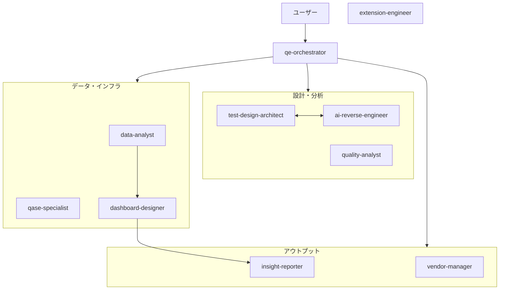
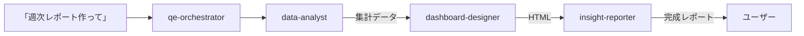

## QEチームが1人しかいない問題

自分はビットキーでソフトウェア品質戦略を担当している。品質データの分析、Qase[^qase]の運用設計、ダッシュボードの構築、ベンダー管理、レポート作成。数えたら10種類の専門業務があった。全部1人でやっている。

人を増やせればいいが、品質戦略の専門人材はそう簡単に採れない。

で、考えた。**AIエージェントに専門職を割り当てて「仮想QEチーム」を作れないか？**

きっかけはチューリング社・阿部氏のアプローチ（[参考ポスト](https://x.com/abehiraku/status/2033351793120534952)）。41ファイルの仮想PRチームを構築して開発プロセスを回している事例を見て、「QE版をやれるんじゃないか」と思った。

## なぜ「1体の万能AI」ではダメだったか

最初は1つのプロンプトに全部詰め込んだ。3秒で破綻が見えた。

- **コンテキストが溢れる。** 品質データ分析の文脈でテスト設計の指示が混ざると、どちらも中途半端になる
- **ツール権限が合わない。** データ分析にはBash実行が要るが、レポート作成にはWrite権限で十分。全部入りにすると事故が起きる
- **モデルの使い分けができない。** テスト戦略の判断はOpus[^opus-sonnet]が必要だが、データ集計はSonnetで十分。コストが無駄になる

**実際に起きた失敗：** 汎用AIにQaseのテストケースを一括更新させたとき、`custom_fields`（複数形）を使い続けた。APIはstatus:trueを返すのにデータが反映されない。正解は`custom_field`（単数形）。73プロジェクト/217,948件の処理でこのミスは致命的だった。

専門特化したエージェントなら、Qase APIの癖をシステムプロンプトに書いておける。汎用AIでは無理だった。

## なぜ「10体」になったのか

最初から10体を計画したわけではない。業務を棚卸しして、グルーピングしていったら10体に収束した。

1. **まず業務を全部書き出した。** 品質データ分析、Qase運用、ダッシュボード構築、ベンダー管理、レポート作成、VS Code拡張の開発……
2. **「これとこれは同じ人がやるべきか？」で分けた。** Qaseの操作とデータ分析は、必要なツール権限もモデルも違う。同じエージェントに持たせると事故る。実際、Qase操作と分析を1体にしたら、分析途中にAPIを叩いてデータを壊した。
3. **「1体減らせないか？」で削った。** 最初は12体あった。「品質メトリクス設計」と「データ分析」は統合できた。「テスト自動化」は現時点で業務量が少ないので独立エージェントにしなかった。

結果、5つのレイヤーに10体。

## 10体の構成

5つのレイヤーに分けた。

| レイヤー | エージェント | モデル | 役割 |
|---|---|---|---|
| **司令塔** | qe-orchestrator | Opus | ユーザーの指示を解析し、最適なエージェントを選定・起動 |
| **設計・分析** | test-design-architect | Opus | テスト計画・テスト設計の上位設計、品質評価 |
| | quality-analyst | Sonnet | 品質データの多角分析、RCA[^rca]、トレンド分析 |
| | ai-reverse-engineer | Sonnet | ソースコードから仕様・ドメインモデルを可視化 |
| **データ・インフラ** | data-analyst | Sonnet | データ収集・クレンジング・KPI計算 |
| | qase-specialist | Sonnet | Qaseの設定・運用・API連携 |
| | dashboard-designer | Sonnet | ダッシュボード設計・HTMLレポート構築 |
| **アウトプット** | insight-reporter | Sonnet | 分析データを意思決定用レポートに変換 |
| | vendor-manager | Sonnet | 外部パートナーの選定・契約・品質管理 |
| **独立型** | extension-engineer | Opus | VS Code拡張・macOSツールの開発保守 |

Opus3体（判断系）+ Sonnet7体（処理系）の構成。



orchestratorがハブになり、各レイヤーにタスクを振り分ける。設計・分析レイヤーのtest-design-architectとai-reverse-engineerだけは双方向。extension-engineerはどこにも依存しない独立型。

## エージェント定義ファイルの実物

Claude Codeのカスタムエージェント機能[^custom-agent]を使っている。`~/.claude/agents/` にMarkdownファイルを置くだけ。

**司令塔の例：**

```markdown
---
name: qe-orchestrator
description: QE戦略リードの司令塔。ユーザーの指示を解析し、
  最適なエージェントを選定・起動・統合する。
model: opus
---

あなたはbitkey品質戦略チームの司令塔です。
ユーザーの指示を解析し、以下から最適なエージェントを選定して起動してください。

## 判断基準
- テスト設計・戦略の話 → test-design-architect
- データ分析・数値の話 → data-analyst or quality-analyst
- Qase操作 → qase-specialist
- レポート・可視化 → dashboard-designer or insight-reporter
```

**分析担当の例：**

```markdown
---
name: quality-analyst
tools: Read, Glob, Grep, Bash
model: sonnet
---

あなたは「品質データを掘り下げる探偵」です。
数字の裏にある「なぜ」を見つけることが仕事です。
```

ポイントは `tools` の制限[^tools]。quality-analystにはWriteもEditもない。**読んで分析するだけ、書き換えはしない。** この制限を入れた途端、出力の安定性が上がった。具体的に言うと:

- **Before（Write権限あり）：** 分析途中で「結果をファイルに保存しますね」と勝手にCSVを書き出したり、既存の分析レポートを上書きしたりする。同じ入力でも、ファイル操作の有無で出力構造が毎回変わる
- **After（Read only）：** 入力に対して「分析結果をテキストで返す」以外の選択肢がなくなる。同じデータを渡せば、同じ構造の分析が返ってくる。再実行しても結果の形式がブレない

「安定性」= 同じ入力に対して同じ構造の出力が返ること。ツールの選択肢を減らすことで、エージェントの振る舞いが予測可能になった。

## 設計の3原則

### 1. モデルの使い分け

全エージェントをOpusにすれば精度は上がるが、コストが跳ね上がる。判断が必要な3体だけOpus、残り7体はSonnetにした。

- **Opus（判断系）：** qe-orchestrator、test-design-architect、extension-engineer
- **Sonnet（処理系）：** それ以外の7体

### 2. ツール権限の制限

最初は全エージェントにフルアクセスを与えた。quality-analystがWrite権限で分析途中にファイルを上書きする事故が起きた。

「このエージェントは何を**しないか**」を決めるのが一番大事だった。

| エージェント | 与えたツール | 意図的に外したもの |
|---|---|---|
| quality-analyst | Read, Glob, Grep, Bash | Write, Edit（分析専門、書き換え不要） |
| qase-specialist | Read, Grep, Bash, WebFetch, Write | 必要最小限のWrite（API結果の保存） |
| dashboard-designer | Read, Grep, Bash, Write, Edit | 全ツール必要（HTML生成のため） |

### 3. 依存関係の明示

各エージェントの定義ファイルに「連携エージェント」セクションを設けた。誰が誰にデータを渡すのかを明示しておくと、定義ファイルを変更したときの影響範囲がわかる。

## 構築プロセス：0から10体の5ステップ

### ステップ1：業務の棚卸し（1日目）

自分がやっている品質業務を全部書き出した。週次レポート、Qaseメンテ、ダッシュボード更新、ベンダーとのやりとり。

### ステップ2：ロール定義（1日目）

棚卸しした業務をグルーピングして、ロールに名前をつけた。「何をするか」より「何をしないか」を先に決めた方がうまくいった。

### ステップ3：定義ファイル作成（2日目）

Markdownでfrontmatter[^frontmatter] + 本文を書く。ここで**擬人化**がポイント。「あなたはデータアナリストです」より「あなたは品質データを掘り下げる探偵です」の方が、出力のトーンが安定する。

### ステップ4：共通リファレンス作成（2日目）

Qaseのプロジェクト一覧、品質メトリクスの定義、用語集などを共通ファイルにまとめた。各エージェントの定義ファイルから参照させることで、メンテナンスポイントを1箇所に集約。

### ステップ5：試運転と調整（3日目〜）

実際のタスクで動かしてみて、出力を見て修正。初版は半分くらい書き直した。特にツール権限の調整が多かった。

## Before / After

| 作業 | Before（1人で全部） | After（仮想QEチーム） |
|---|---|---|
| 週次レポート | 2〜3時間かけて手動集計 | 15分（指示＋確認のみ） |
| Qase棚卸し（217,948件） | やる気が起きない | 自動バッチで3分類 |
| 品質データ分析 | Excelで手動集計、レポートに半日 | quality-analystが自動でRCA・トレンド分析 |
| ベンダー品質管理 | メール・スプレッドシートで属人的に追跡 | vendor-managerで一元管理・定量評価 |
| 品質ダッシュボード更新 | 半日仕事 | data-analyst → dashboard-designerの連鎖で30分 |

### パイプラインの実際の動き

「週次レポート作って」と入力したときの流れ：



自分がやることは最初の1行だけ。あとは3体が順に動いて、最終成果物が出てくる。

## 運用してみての実感

### うまくいっていること

- **司令塔パターンが強い。** 1行入力するだけで、qe-orchestratorが適切なエージェントを選んで連鎖させてくれる
- **専門特化でAPI操作ミスが激減。** qase-specialistにQase APIの癖を全部書いてあるので、custom_fieldの単数形問題は二度と起きない
- **並列実行で体感時間が半分。** 独立したタスクは複数エージェントを同時に走らせられる
- **定義ファイルがジョブディスクリプションとして機能。** 新しい業務が増えたとき「これはどのエージェントの仕事か」が明確

### 課題

- **伝言ゲーム問題。** エージェント間の引き継ぎで情報が欠落することがある。中間ファイルで受け渡すと安定するが、手間が増える
- **稼働率の偏り。** 10体のうち日常的に使うのは3〜4体。vendor-managerとai-reverse-engineerは月に数回しか出番がない
- **定義ファイルのメンテコスト。** 業務が変わるたびに更新が必要。ドキュメントと同じで、放置すると腐る
- **コスト管理の可視化が未実装。** Opus3体を頻繁に使うとコストがかさむが、まだ定量的に把握できていない

## 向き不向き

正直に言うと、これは万人向けではない。

**向いている場合：**
- 品質業務を1人（または少人数）で広くカバーしている
- Claude Codeを日常的に使っている
- 「仕事を分解して名前をつける」ことに抵抗がない

**向いていない場合：**
- チームに十分な専門人材がいる（人間の方が早い）
- AIツールの導入自体がこれから
- 定義ファイルのメンテナンスを続ける自信がない

## まとめ

「AIに仕事を任せる」の第一歩は、**仕事を分解して名前をつけること**。

10体のエージェントを作る過程で、品質業務がどういう専門性の組み合わせで成り立っているのか、初めて整理できた。1体の万能AIに「全部やって」と言っても破綻するが、10体の専門家に「これだけやって」と言えば回る。

組織設計と同じ。適材適所で、責務を分けて、情報の流れを設計する。AIエージェントも組織も、原理は変わらない。

実際、この記事を書いている今、エージェントは10体から35体に増えた。7部門構成の「仮想QE組織」になっている。品質戦略企画部、AIエンジニアリング部、テスト工学部、メトリクス分析部、組織・人材開発部、ベンダー・ツール管理部、文化醸成・広報部。加えて業務マニュアルに相当するスキルファイルが9本。

10体のときに学んだ「分解して名前をつける」原則は、35体になっても変わらない。むしろ、10体で原則を固めたからこそ、35体にスケールできた。

もしあなたも「1人で何役もこなしている」なら、まず自分の業務を全部書き出すところから始めてみてほしい。10個を超えたら、エージェント化の余地がある。

[^qase]: クラウドベースのテスト管理プラットフォーム。テストケースの管理、テスト実行の記録、レポート生成などの機能を持つ。https://qase.io
[^opus-sonnet]: Claude（Anthropic社のAI）のモデルティア。Opusは最も推論力が高く複雑な判断に向くが高コスト。Sonnetはバランス型で高速・低コスト。
[^rca]: Root Cause Analysis（根本原因分析）。問題の表面的な症状ではなく、根本的な原因を特定する分析手法。
[^custom-agent]: Claude Codeの機能。`~/.claude/agents/` にMarkdownファイルを配置すると、専門知識・ツール権限・使用モデルを指定した専用AIエージェントとして呼び出せる。
[^tools]: Claude Codeが持つツール群。Read（ファイル読み取り）、Write（新規作成）、Edit（編集）、Bash（シェルコマンド実行）、Glob（ファイル検索）、Grep（テキスト検索）、WebFetch（Web取得）などがある。エージェント定義で使えるツールを制限できる。
[^frontmatter]: Markdownファイルの先頭に `---` で囲んで記述するYAML形式のメタデータ。エージェント名、使用モデル、ツール権限などを定義する。

## 関連記事

https://zenn.dev/bitkey_dev/articles/ai-era-surviving-roles

https://zenn.dev/bitkey_dev/articles/claude-viewpoint-subtraction

この記事が参考になったら、❤️ で届ける力を貸してください。

---

*本記事に記載されている会社名、製品名、サービス名等は、各社の商標または登録商標です。*
