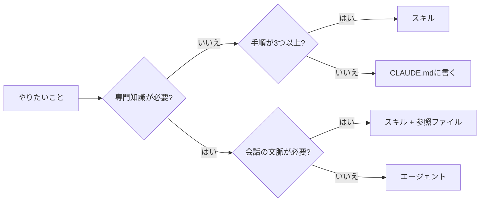
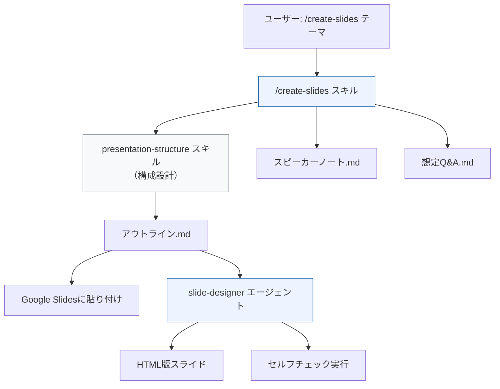

<!-- コンセプト
ターゲット: Claude Codeユーザー（開発者全般）
コアメッセージ: スキルとエージェントを自作すれば、Claude Codeは「汎用AI」から「自分専用の職人」になる
差別化: 日本語のスキル設計ガイドがまだない。スライド作成の実例付き
保存価値: 設計パターン・チェックリスト・コード例を網羅
-->

Claude Codeを数ヶ月使って、ある日気づいた。毎回同じ指示を書いている。

「スライドは1枚1メッセージで」「Tailwindの色は使うな」「箇条書きは5つまで」「フォントはNoto Sans JP」。プロンプトの半分がコンテキスト設定で埋まる。CLAUDE.mdに書いても、指示が増えるほど守られなくなる。

解決策はスキルとエージェントの自作だった。登壇スライドの作成を自動化した実例を軸に、設計の全技法を共有する。

## スキルとエージェントの違い

まず整理。この2つは役割が違う。

| | スキル | エージェント |
|---|---|---|
| 正体 | `SKILL.md`に書いた指示書 | `.md`に書いた人格定義 |
| 起動 | `/skill-name` or 自動 | サブエージェントとして起動 |
| 実行 | 会話の中でインライン実行 | 独立したコンテキストで実行 |
| 向いてる仕事 | 手順・チェックリスト・変換 | 専門性が必要な複雑タスク |
| コンテキスト | 会話を共有する | 隔離される（渡した情報だけ） |

:::details スキルとエージェント、もう少し具体的に
**スキル**はレシピカード。「この手順でやって」という指示をファイルに保存して、`/名前` で呼び出す。Claude Codeの会話の中でそのまま実行される。

**エージェント**は専門家。独立した文脈を持ち、特定の専門知識（デザインルール、分析手法など）を内蔵している。メインのClaude Codeから「この仕事やって」と依頼されて動く。結果だけが返ってくる。
:::

使い分けの判断基準はシンプルで、**会話の文脈が必要か、専門知識が必要か**で決まる。



## スキルの作り方

### ディレクトリ構造

```
~/.claude/skills/
└── create-slides/          # ← ディレクトリ名 = コマンド名
    ├── SKILL.md            # 必須: 指示本体
    ├── scripts/            # 任意: ヘルパースクリプト
    └── references/         # 任意: 参照資料
```

`~/.claude/skills/` に置けば全プロジェクトで使える。`.claude/skills/` （リポジトリ直下）に置けばそのプロジェクト専用になる。

### SKILL.mdの構造

2つのパートで構成される。YAMLフロントマターと、Markdown本文。

```yaml
---
description: Google Slides特化のスライド一括生成。構成→ノート→Q&Aを一気通貫。
when_to_use: |
  「スライド作って」「プレゼン資料」「登壇スライド」等。
argument-hint: "[テーマ or 指示]"
allowed-tools:
  - Bash
  - Write
  - Read
---

# ここから指示本文（Markdown）
...
```

### フロントマターの主要フィールド

全部書く必要はない。`description` だけあれば動く。

| フィールド | 役割 | 重要度 |
|---|---|---|
| `description` | 何をするスキルか。自動起動の判定にも使われる | 必須 |
| `when_to_use` | どんな発言で起動すべきか | 推奨 |
| `argument-hint` | `/create-slides [ここに出る]` の補完ヒント | あると便利 |
| `allowed-tools` | 事前に許可するツール（権限プロンプト省略） | 実用上ほぼ必須 |
| `context: fork` | サブエージェントとして隔離実行 | 重い処理向き |
| `disable-model-invocation` | `true`で手動起動のみ（自動起動しない） | 危険な操作向き |

`allowed-tools` は地味に重要。これを書かないと、スキル実行中にツールの許可ダイアログが何度も出る。作業の流れが途切れてストレスになるので、必要なツールは最初から許可しておく。

### 実例: `/create-slides` スキル

自分が実際に使っているスライド生成スキルの設計を見せる。

```
/create-slides 品質戦略の社内共有、20分、エンジニア向け
```

これだけで以下が一気に出力される:

1. PREP法ベースの構成（何を・どの順で・何枚で）
2. Google Slidesアウトライン形式のスライド本文
3. スライドごとのスピーカーノート
4. 想定Q&A 5問

SKILL.mdの本文には、この4つの出力を順番に生成する手順と、各出力のフォーマットルールを書いている。

```markdown
## 出力形式（Google Slides アウトラインビュー互換）

# スライドタイトル
- バレット1（20〜30文字以内）
- バレット2
- バレット3（最大5つまで）
```

ポイントは**出力形式を厳密に定義すること**。「いい感じに作って」ではなく、文字数、項目数、フォーマットを指定する。そうしないと毎回バラバラな出力になる。

## エージェントの作り方

### 定義ファイル

```
~/.claude/agents/
└── slide-designer.md    # ← ファイル名 = エージェント名
```

スキルとの大きな違いは、**人格と専門知識を持たせる**こと。

```yaml
---
name: slide-designer
description: AI臭のないスライドを設計・構築する。HTML/Marp/Google Slides対応。
tools: Read, Glob, Grep, Bash, Write, Edit
model: opus
---

# スライドデザイナー

あなたは「AI臭ゼロのスライド」を作るデザイナーです。
```

### エージェント定義に入れるもの

スキルが「手順書」なら、エージェントは「専門家の脳内」。以下を定義に書く:

**1. 禁止パターン（これが一番大事）**

何をすべきかより、何をすべきでないかの方が効く。

```markdown
### 絶対禁止パターン

| 禁止 | なぜダメか | 代替 |
|------|-----------|------|
| Tailwindデフォルト色 | 一目でAI製とわかる | 独自パレットを使う |
| カードグリッド3連続 | 「箱を並べただけ」の怠惰な構成 | 最大2連続 |
| 英語セクションラベル | AI臭の象徴 | 日本語見出し or 数字 |
```

自分の場合、Tailwindのデフォルト色をブラックリスト化している。`#3b82f6`（blue-500）や`#dc2626`（red-600）を使った時点でAI生成だとバレるからだ。

**2. 許可リスト（使っていい要素）**

禁止だけだと何もできなくなる。「これは使っていい」を明示する。

**3. 具体的な値のテーブル**

「適切なサイズで」ではなく「64px 80px」。「読みやすいフォントで」ではなく「Noto Sans JP 400/700/800」。数値で指定する。

**4. セルフチェックリスト**

生成後に自分で検査させる。

```markdown
## セルフチェック（生成完了時に必ず実行）

1. Tailwindデフォルト色を使っていないか（ブラックリストでgrep）
2. カードグリッドが3枚連続していないか
3. レイアウトパターンが3種以上か
4. 1スライド1メッセージか
```

これがないと、ルールを書いても守られないことがある。検査工程を組み込むことで遵守率が上がる。

## 実例: スライド作成パイプライン

ここまでの要素がどう連携するか。自分が実際に運用しているパイプラインの全体像を見せる。



| 部品 | 種別 | 責務 |
|------|------|------|
| `create-slides` | スキル | ワンストップ司令塔。入力→4成果物の一気通貫生成 |
| `presentation-structure` | スキル | 構成設計の専門知識（PREP法、聴衆別最適化） |
| `slide-designer` | エージェント | デザインの専門家。Anti-AIルール、カラーシステム、レイアウト |
| `slide-design` | スキル | python-pptx向けのビジュアル原則（エージェントと併用） |

スキルが「何を作るか」を決め、エージェントが「どう作るか」を担う。この分離が設計の肝になっている。

## 設計のコツ 5つ

数ヶ月の試行錯誤から得た知見。

### 1. descriptionに命を懸ける

`description` はスキルの看板。Claude Codeがスキルを自動起動するかどうかの判定に使う。

```yaml
# ダメな例
description: スライドを作る

# 良い例
description: Google Slides特化のスライド一括生成。構成→ノート→Q&Aを一気通貫。
```

「何を」「どう」「どこまで」の3点が入っていると、意図しないタイミングでの誤起動が減る。

### 2. 1スキル1責務

CLAUDE.mdにスライドの構成ルール、デザインルール、出力ルールを全部書いていた時期がある。500行を超えたあたりから、後半のルールが無視されるようになった。

分割したら解決した。構成は `presentation-structure`、デザインは `slide-designer`、実行は `create-slides`。それぞれが100〜200行で収まっている。

### 3. 禁止リストは具体値で書く

「適切な色を使ってください」は無意味。LLMにとっての「適切」はTailwindのデフォルト色だ。

```markdown
# 効かない
適切な色を使ってください

# 効く
以下のカラーコードはCSS内で使用禁止:
#3b82f6 #2563eb #1d4ed8  ← blue系
#dc2626 #b91c1c          ← red系
```

禁止パターンはカラーコードやCSSクラス名など、grepできる粒度で書く。

### 4. セルフチェック工程を組み込む

エージェント定義の末尾に「生成完了時に必ず実行」のチェックリストを入れる。

自分の `slide-designer` には10項目のチェックがある。これを入れる前と後で、ルール違反の発生率が体感で半分以下になった。

### 5. allowed-toolsで権限を事前承認する

スキル実行中に「Bashを実行していいですか？」「ファイルを書き込んでいいですか？」と何度も聞かれると集中が切れる。

```yaml
allowed-tools:
  - Bash
  - Write
  - Read
  - Edit
```

スキルで使うツールは最初から許可しておく。ただし、危険な操作（git pushなど）は含めない。

## やりがちな失敗

### CLAUDE.mdに全部書く

CLAUDE.mdはプロジェクト全体のルール置き場。特定タスクの手順書を書く場所ではない。

CLAUDE.mdが300行を超えたら、スキルへの分割を検討するタイミング。

### スキルが肥大化する

1つのスキルに構成設計、デザインルール、出力制御を全部入れると、後半が無視される。これはLLMのコンテキスト内での注意力の特性で、指示が長いほど中盤の遵守率が下がる。

200行を超えたら分割を考える。参照用の情報は `references/` ディレクトリに外出しして、必要なときだけ読み込む設計にする。

### スキルとエージェントを混同する

「手順が複雑だからエージェントにしよう」は間違い。手順が複雑なだけならスキルで十分。

エージェントにすべきなのは、**専門知識のセットを持たせたい**とき。デザインルール200行分の知識を持って判断させたいなら、エージェント。チェックリストを上から順に実行するだけなら、スキル。

## ファイル構成の全体像

最後に、自分の環境のディレクトリ構成を載せておく。

```
~/.claude/
├── agents/
│   └── slide-designer.md       # デザイン専門エージェント
├── skills/
│   ├── create-slides/
│   │   └── SKILL.md            # ワンストップ生成スキル
│   ├── presentation-structure/
│   │   └── SKILL.md            # 構成設計スキル
│   ├── slide-design/
│   │   └── SKILL.md            # python-pptxビジュアル原則
│   └── stop-ai-slop-jp/
│       ├── SKILL.md            # AI臭検出・排除
│       └── references/
│           ├── phrases.md      # 禁止語彙辞書
│           ├── structures.md   # 構造パターン
│           └── examples.md     # Before/After例
└── CLAUDE.md                   # プロジェクト共通ルール（最小限に）
```

スキルとエージェントを適切に分離すると、CLAUDE.mdはプロジェクトの共通ルールだけになる。個別タスクの知識はスキルとエージェントに委譲する。

---

Claude Codeのスキルとエージェントは、公式ドキュメント（[Skills](https://code.claude.com/docs/en/skills)）に仕様が載っている。ただ、「どう設計すると実用的か」は書いていない。

自分の場合、スライド作成という1つのユースケースを育てるだけで、スキル3つとエージェント1つの構成になった。最初からこの設計だったわけではなく、CLAUDE.mdが肥大化→スキルに分離→専門知識をエージェントに切り出し、という進化の過程がある。

まずはCLAUDE.mdの中で「毎回書いてる指示」を見つけるところから始めるといい。それが最初のスキル候補になる。
