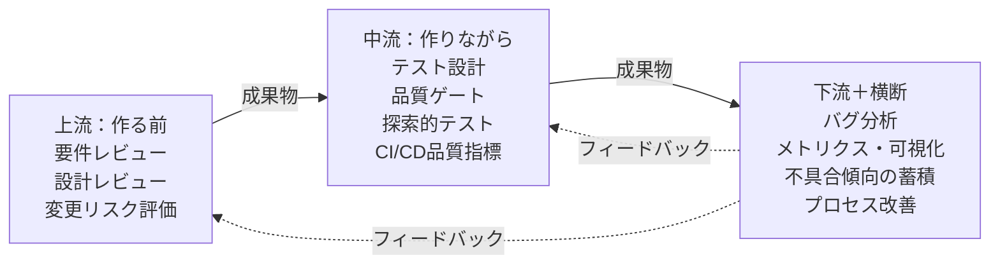

<!-- コンセプト
ターゲット: テスト実行が中心のQAエンジニア・テスター。「テスト以外に何すればいいの？」と思っている人
方向性: 入門・再入門型。「全部並べてみた」系のカタログ記事
テーマ層: テスト≠QAシリーズの実践編。test-equals-qa.mdで「QA＝仕組みをつくること」と書いた。じゃあ具体的に何があるのか。
-->

:::message
「QAチームに配属されたけど、やっているのはテスト実行だけ」「テスト以外にQAって何するの？」と思ったことはないだろうか。
:::

以前、[「テスト＝QA」を卒業する日](https://zenn.dev/bitkey_dev/articles/test-equals-qa)という記事で、テスト・QC・QAの違いを整理した。

- テスト＝測る（今の状態を確認する）
- QC＝直す（見つけた問題を潰す）
- QA＝仕組む（良いものが生まれる仕組みをつくる）

「QA＝仕組みをつくること」とわかった。じゃあ具体的に何すればいいのか。

自分がQAとして手を動かしてきた中で、テスト実行以外にやってきた活動を全部並べてみる。

## たとえ話：健康管理

テスト実行だけのQAは、**年に一度の健康診断だけで健康を保とうとしている**ようなものだ。

健康診断は大事だ。でも、本当に健康でいたいなら、食事管理、運動、睡眠、ストレス管理、生活習慣の見直しが必要になる。検査の「前」と「後」にやることがたくさんある。

QAも同じだ。テスト実行は健康診断。それ以外の活動が、食事や運動や生活習慣にあたる。

## QA活動の全体マップ

整理の軸は「いつやるか」。開発の流れに沿って3つに分けた。

| 時間軸 | いつやるか | たとえ（健康管理） |
|---|---|---|
| **上流** | 作る前 | 食事管理・運動（予防） |
| **中流** | 作りながら | 体重計・血圧計で日々チェック（モニタリング） |
| **下流＋横断** | 出した後＋常時 | 検査結果の分析・生活習慣の見直し（改善） |

### 活動のつながり

ここで大事なのは、これが一方通行じゃないということだ。**下流の学びが上流に戻るフィードバックループ**が回って初めて「仕組み」になる。

実線は「成果物の流れ」、点線は「フィードバック」だ。各活動の詳しいつながりは下のI/Oテーブルで確認してほしい。

注目してほしいのは点線の4本。バグ分析で「仕様が曖昧だったから作り込まれた」とわかれば、次の要件レビューの精度が上がる。不具合傾向を蓄積すれば、観点カタログとしてテスト設計に活かせるし、「どこにバグが集中しているか」のデータとして変更リスク評価にも効く。このループが回り始めると、同じバグが二度と生まれなくなる。

### 各活動のインプットとアウトプット

| 活動 | インプット | アウトプット | 渡し先 |
|---|---|---|---|
| **要件レビュー** | PRD・要件定義書 | テスト可能な要件、指摘リスト | → テスト設計 |
| **設計レビュー** | 設計書・アーキテクチャ図 | テスト容易性の指摘、改善案 | → テスト設計 |
| **変更リスク評価** | 変更差分・**不具合傾向データ** | 重点テスト箇所のリスト | → テスト設計 |
| **テスト設計** | 要件＋設計＋リスク評価 | テスト観点、テストケース | → 探索的テスト、品質ゲート |
| **品質ゲート** | PR・成果物 | 通過／差し戻し判定 | → CI/CD |
| **CI/CD品質指標** | ソースコード・テスト結果 | カバレッジ、静的解析結果 | → メトリクス |
| **探索的テスト** | テスト設計＋ドメイン知識 | バグ報告、リスク知見 | → バグ分析 |
| **メトリクス・可視化** | バグ数・テスト結果 | 品質傾向ダッシュボード | → プロセス改善 |
| **バグ分析（RCA）** | バグ報告 | 根本原因、再発防止策 | → 不具合傾向の蓄積、**要件レビュー** |
| **不具合傾向の蓄積** | RCA結果・過去バグ | 観点カタログ、バグパターン集 | → **テスト設計**、**変更リスク評価** |
| **プロセス改善** | メトリクス・ふりかえり結果 | 改善施策、プロセス変更 | → **要件レビュー** |

**太字**の渡し先がフィードバックループ。ここが回ると「仕組み」になる。

では、それぞれ何をするのか。

## 上流：「作る前」にやること

ここが一番コスパがいい。**バグは、作り込まれた後に見つけるより、作り込まれる前に防ぐほうが圧倒的に安い**。

### 要件レビュー

要件定義の段階で、テストの視点からレビューする。

「この要件、テストできるか？」と問いかけるだけで、曖昧な要件が浮かび上がる。

| 曖昧な要件の例 | 問題点 |
|---|---|
| 「適切に処理する」 | 「適切」の基準がない。テストできない |
| 「高速に応答する」 | 「高速」が何秒か不明 |
| 「必要に応じてエラーを表示」 | 「必要」の条件が定義されていない |
| 「大量のデータを処理できること」 | 「大量」が100件なのか100万件なのかわからない |

:::details 要件レビューのコツ
要件を読んだとき、「〜など」「適切に」「必要に応じて」「高い」「大量の」といった言葉が出てきたら黄色信号だ。テストケースに落とせない要件は、そもそも正しく実装できない。

QAが要件レビューに参加するだけで、テストフェーズでの「これってどういう仕様でしたっけ？」という手戻りが大幅に減る。
:::

### 設計レビュー

設計の段階で、**テストしやすさ**の観点からレビューする。

たとえば「この設計だと結合テストでしか確認できない」という箇所を、単体テストで確認できる設計に変えられないか検討する。テストし易い設計は、バグが入り込みにくい設計でもある。

### 変更リスク評価

「今回の変更で、どこが壊れ易い？」を事前に見積もる。

たとえば「決済モジュールに新しい支払い方法を追加する」というリリース。何も考えずにテストすると、新機能だけ見て終わりがちだ。でもリスク評価をかけると、景色が変わる。

| チェック観点 | 確認すること | 具体例 |
|---|---|---|
| 変更差分 | 今回どのファイルが変わったか | 決済モジュール＋共通の金額計算ライブラリ |
| バグ履歴 | 過去にバグが集中した箇所は？ | 金額計算は過去3カ月で5件のバグ。要注意 |
| 影響範囲 | 壊れたときのダメージは？ | 決済は全ユーザーに影響。最優先 |
| 連携箇所 | 他の機能との組み合わせは？ | ポイント併用・クーポン適用との組み合わせ |

この結果が「重点テスト箇所のリスト」としてテスト設計にわたる。「全部テストする」のではなく「危ないところを重点的にテストする」という発想だ。

:::details リスクベーステストとは？
テスト対象のリスク（壊れやすさ × 壊れたときの影響）を評価して、リスクが高い箇所から優先的にテストする手法。すべてをテストする時間がないとき（つまりほぼ常に）に、テストの効果を最大化できる。インプットは「変更差分」と「過去のバグ履歴」。この2つがあれば、最低限のリスク評価はできる。
:::

## 中流：「作りながら」やること

開発が走っている最中に、品質をリアルタイムで見張る活動だ。ここが弱いと、問題に気づくのがいつもリリース直前になる。

### 品質ゲート

開発の途中に「ここを通過しないと次に進めない」チェックポイントを置く。

大げさなものじゃなくていい。たとえばPRテンプレートにこれを足すだけでも立派な品質ゲートだ。

- [ ] テスト観点を記載した
- [ ] 影響範囲を確認した
- [ ] エッジケースを検討した

:::details 品質ゲートとは？
次の工程に進んで良いかを判定するチェックポイント。テストだけがゲートではなく、コードレビュー、設計レビュー、セキュリティチェックなども品質ゲートになる。
:::

### CI/CDへの品質指標の組み込み

コードがマージされるたびに自動で品質をチェックしてくれる。人間がいちいち手を動かさなくていい。

| チェック項目 | ツール例 | 何がわかるか |
|---|---|---|
| テストカバレッジ | Jest, pytest | 新規コードがテストされているか |
| 静的解析 | ESLint, SonarQube | コードの品質問題の早期検出 |
| セキュリティスキャン | Snyk, Dependabot | 脆弱性の検出 |
| 型チェック | TypeScript, mypy | 型の不整合の検出 |

:::details CI/CDとは？
CI（Continuous Integration）は、コードの変更を頻繁に統合して自動テストを回すこと。CD（Continuous Delivery/Deployment）は、テスト済みのコードを自動でデプロイすること。「コードを書いたら自動でチェックしてくれる仕組み」くらいの理解で十分だ。
:::

### テスト設計

テスト「実行」ではなく「設計」のほう。

何をテストして何をテストしないか。どの観点で攻めるか。正直、テスト実行よりこっちのほうがずっと難しいし、ずっと価値がある。

テスト設計について詳しくは「[テスト観点が書けないのは「出し方の型」を知らないだけ](https://zenn.dev/bitkey_dev/articles/test-viewpoint-howto)」で書いている。

### 探索的テスト

テストケースに書かれていないことを、あえて試す。

「ユーザーが本当にやりそうな操作は何か？」「仕様書には書いてないけど、これ試したらどうなる？」。経験と直感でバグを嗅ぎ出す、テスターの腕の見せどころだ。

:::details 探索的テストとは？
事前にテストケースを用意せず、テスターの知識と経験に基づいてテスト対象を探索する手法。「テストチャーター」と呼ばれる大まかな方向性だけ決めて、あとはテスターの判断で自由にテストする。仕様書の行間にあるバグを見つけるのに向いている。
:::

## 下流＋横断：「出した後」と「ずっと」やること

ここからが「QAらしい」仕事だと自分は思っている。テストで見つけたバグを、**次は作り込まれないようにする**。この「戻すループ」があるかないかで、チームの品質は半年後にまるで変わる。

### メトリクス・可視化

「最近品質どう？」「うーん、なんとなく良い感じです」。これでは何も判断できない。数値で語れるようにする。

| メトリクス | 何がわかるか |
|---|---|
| バグ密度（バグ数÷コード量） | プロダクト全体の品質傾向 |
| バグ検出率（テスト発見÷全バグ） | テストの有効性 |
| リリース後バグ率 | テストで漏れた問題の量 |
| 平均修正時間 | バグ対応のスピード |

:::details メトリクスの注意点
数値は判断材料であって、目標ではない。「バグ密度を下げろ」と号令をかけると、バグを報告しなくなるだけだ。メトリクスは「現状を知る」ために使い、「目標を追う」ために使わないのがコツだ。
:::

### バグ分析（RCA）

バグを直して終わり、にしない。**なぜそのバグが生まれたのか**を掘る。

「なぜ作り込まれた？」→「仕様が曖昧だった」→「要件レビューで気づけたはず」→「次からQAもレビューに入ろう」

バグ1件から改善施策が1つ出る。これを回すと、テスト（＝測る）の結果がQA（＝仕組む）に変わる。

バグ分析の具体的な始め方は「[週15分「バグに3つの問いを投げる」](https://zenn.dev/bitkey_dev/articles/qa-first-analysis-ritual)」で書いている。

:::details RCA（根本原因分析）とは？
Root Cause Analysis。問題の直接的な原因ではなく、根本的な原因を特定する手法。「なぜ？」を繰り返して深掘りする「なぜなぜ分析」が代表的。バグを直すだけでなく、バグが生まれた構造を直す。
:::

### 不具合傾向の蓄積

バグ分析で出てきた知見を、**次のテスト設計で使える形**にまとめていく。

地味な作業だが、3カ月も続けるとパターンが見えてくる。

| バグパターン | 発生箇所 | 頻度 | テスト設計への反映 |
|---|---|---|---|
| 日付の境界値ミス | 予約・期限系の機能 | 月2〜3件 | → 日付系機能には必ず境界値テストを入れる |
| 状態遷移の考慮漏れ | ステータス管理全般 | 月1〜2件 | → 状態遷移図を描いてからテスト設計する |
| 外部API連携のエラーハンドリング漏れ | 決済・通知 | 四半期1〜2件 | → 異常系シナリオを必須観点にする |

これが**観点カタログ**になる。「このチームではこういうバグが起き易いから、ここを重点的にテストする」。新しいメンバーが来ても、カタログがあれば一定水準のテスト設計ができる。

バグ分析→傾向蓄積→テスト設計。この地道なサイクルが、フィードバックループの一番おいしいところだ。

### プロセス改善

ふりかえり（レトロスペクティブ）に品質の話題を持ち込む。

「今スプリントのバグ、上流で防げたのはいくつあった？」「テスト設計に使える時間、足りてる？」。こういう問いを定期的に投げるだけで、チームの目が変わる。開発プロセスの改善は、結局こうした小さな問いの積み重ねだ。

## どこから始めるか

ここまで読んで「やることが多すぎる」と思ったかもしれない。全部やろうとすると確実にコケる。

### 明日からできること

| 活動 | 所要時間 | やること |
|---|---|---|
| バグ分析1件 | 30分 | 直近のバグ1件に「なぜ作り込まれた？」を問いかける |
| テスト観点の言語化 | 15分 | 普段のテストで無意識にやっている観点を3つ書き出す |
| PRテンプレへの品質項目追加 | 10分 | 「テスト観点」「影響範囲」を1つ追加する |

### 1カ月で始められること

- **バグパターンTOP5の作成**: 過去3カ月のバグを分類して「よくあるパターン」を特定する
- **品質チェックリストの策定**: チームで2時間ほど話し合い、最低限の品質基準を言語化する
- **テスト観点カタログの初版作成**: 既存のテストケースからテスト観点を逆抽出する

### 組織的に取り組むこと

- CI/CDへの品質ゲート組み込み
- 品質ダッシュボードの構築
- 要件レビュー・設計レビューへのQA参加の制度化

自分の経験上、バグ分析1件から始めるのが一番ハードルが低い。そこからテスト観点カタログが生まれ、カタログからテスト設計が変わり、テスト設計が変わるとプロセスが変わる。一度回り始めると、もう「テスト実行だけ」には戻れなくなる。

## まとめ

テスト実行は、QA活動の一部でしかない。

| 時間軸 | 活動 | 一言で |
|---|---|---|
| 上流 | 要件レビュー、設計レビュー、変更リスク評価 | バグを作り込まない |
| 中流 | 品質ゲート、CI/CD品質指標、テスト設計、探索的テスト | 問題を早く見つける |
| 下流＋横断 | メトリクス、バグ分析、不具合傾向の蓄積、プロセス改善 | 同じ失敗を繰り返さない |

最初に書いた健康管理のたとえに戻ると、健康診断だけで健康は保てない。食事も運動も生活習慣も全部ひっくるめて「健康管理」であるように、テスト実行だけが「QA」じゃない。

まずはバグ分析1件から。30分でいい。それだけで、見える景色がけっこう変わる。

---

## 関連記事

- [「テスト＝QA」を卒業する日](https://zenn.dev/bitkey_dev/articles/test-equals-qa) ── テスト・QC・QAの違いを勉強のたとえで整理
- [テスト観点が書けないのは「出し方の型」を知らないだけ](https://zenn.dev/bitkey_dev/articles/test-viewpoint-howto) ── テスト設計の実践的な書き方
- [週15分「バグに3つの問いを投げる」](https://zenn.dev/bitkey_dev/articles/qa-first-analysis-ritual) ── バグ分析のもっとも小さな始め方
- [テスト見積もりは掛け算2つで出せる](https://zenn.dev/bitkey_dev/articles/test-estimation-formula) ── テスト見積もりの数式化

---

*テストを「作業」から「戦略」に変える人を増やしたい。❤️ いいねで広めてもらえると励みになります。*
